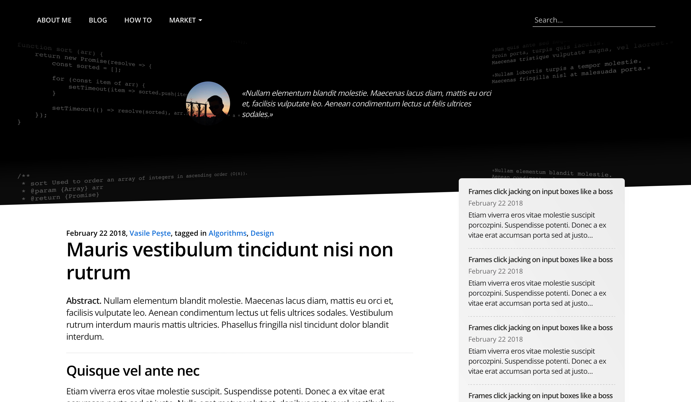

# Abstract Language
Abstract Language is a theme designed from scratch with zero dependencies.
Designed for websites about information technology and programming.

## Overview

## Issues
Do not hesitate to create an issue even for the most irrelevant thing. Feel free to correct my English, recommend a better way to use Git or anything you think could be useful and instructive.

## Design
Each class is considered a unique UI component (in all style sheets and in all commit messages). All class names are following and must follow the BEM convention. All properties are not vendor prefixed since they will be automatically prefixed in production.

## Todo
Implement this theme for the following systems.
- [ ] WordPress
- [ ] Ghost
- [ ] Jekyll
- [ ] Joomla!

## Contact the Author
vasile.peste@protonmail.ch.